<div align="center">

# 🎨 DESIGN PATTERNS

### _The Collapsible Field Guide for Java Developers_


</div>

```text
   ┌──────────────────────────────────────────────────────────┐
   │  Patterns = battle-tested solutions to recurring problems  │
   │                                                            │
   │  🏗️  CREATIONAL   → how objects are created                │
   │  🧱  STRUCTURAL   → how objects are composed               │
   │  🎭  BEHAVIORAL   → how objects talk & share work          │
   └──────────────────────────────────────────────────────────┘
```

> 🧭 **How to use this guide:** every **category** and every **pattern** is collapsible.
> Collapse all → it's a clean index. Expand only what you want to study. 🔽

---

## 🗂️ Index at a Glance

| 🏗️ Creational | 🧱 Structural | 🎭 Behavioral |
|:--------------|:--------------|:--------------|
| Singleton | Adapter | Chain of Responsibility |
| Builder | Composite | State |
| Factory | Decorator | Observer |
| Abstract Factory | Proxy | Template Method |
| Prototype | Flyweight | Strategy |

---

<details>
<summary><h2>🏗️ &nbsp;CREATIONAL PATTERNS</h2></summary>

> _Patterns that deal with **object creation** — making it flexible, controlled, and decoupled from the concrete classes being instantiated._

<br/>

<details>
<summary><b>🔒 1. Singleton</b> — one instance, globally accessible</summary>

<br/>

**Definition.** Ensures a class has **exactly one instance** and provides a single global point of access to it. The class itself controls its instantiation and guards against creating duplicates.

> 🎯 **Problem it solves**
> Some resources should exist only once — a configuration manager, a connection pool, a logger. Letting code freely `new` them up wastes resources and causes inconsistent state (two "configs" disagreeing).

> 🛠️ **How it solves it**
> Make the constructor `private` so no one outside can instantiate it, hold a single static instance internally, and expose it through a static `getInstance()`. The class becomes the sole gatekeeper of its own creation.

**💻 Code (thread-safe, lazy via holder idiom)**

```java
public final class ConfigManager {
    private final Map<String, String> settings = new HashMap<>();

    private ConfigManager() { /* load config once */ }

    // Loaded lazily & thread-safely on first access
    private static class Holder {
        private static final ConfigManager INSTANCE = new ConfigManager();
    }

    public static ConfigManager getInstance() {
        return Holder.INSTANCE;
    }

    public String get(String key) { return settings.get(key); }
}

// Usage — always the same object
ConfigManager cfg = ConfigManager.getInstance();
```

**📊 Diagram**

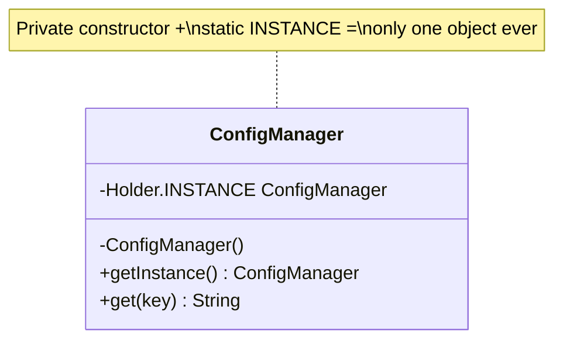

> 💡 **Tip:** In modern Java, a single-element `enum Singleton { INSTANCE; }` is the simplest fully-safe option (serialization & reflection proof).

</details>

<details>
<summary><b>🧰 2. Builder</b> — assemble complex objects step by step</summary>

<br/>

**Definition.** Separates the **construction** of a complex object from its representation, letting you build it step by step with a fluent API. The same construction process can create different configurations of the object.

> 🎯 **Problem it solves**
> Objects with many fields (especially optional ones) lead to "telescoping constructors" — `new Burger(true, false, true, 2, ...)` — which are unreadable and error-prone. You can't tell what each argument means.

> 🛠️ **How it solves it**
> A nested `Builder` collects parameters through chained, named methods, then produces an immutable object via `build()`. Each setter returns the builder, so calls read like a sentence and optional fields are simply skipped.

**💻 Code**

```java
public class Burger {
    private final String bun;
    private final String patty;
    private final boolean cheese;
    private final boolean lettuce;

    private Burger(Builder b) {
        this.bun = b.bun; this.patty = b.patty;
        this.cheese = b.cheese; this.lettuce = b.lettuce;
    }

    public static class Builder {
        private String bun = "regular";
        private String patty = "veg";
        private boolean cheese, lettuce;

        public Builder bun(String b)      { this.bun = b; return this; }
        public Builder patty(String p)    { this.patty = p; return this; }
        public Builder cheese(boolean c)  { this.cheese = c; return this; }
        public Builder lettuce(boolean l) { this.lettuce = l; return this; }
        public Burger build()             { return new Burger(this); }
    }
}

// Usage — readable & flexible
Burger b = new Burger.Builder()
        .bun("sesame").patty("chicken").cheese(true)
        .build();
```

**📊 Diagram**

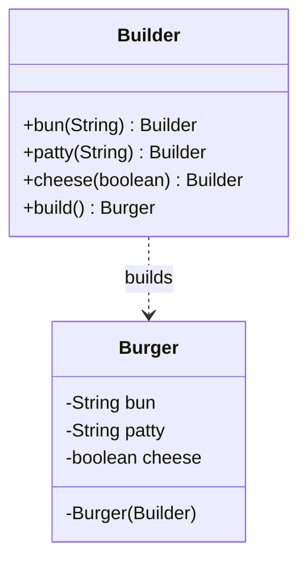

</details>

<details>
<summary><b>🏭 3. Factory Method</b> — delegate object creation to a method</summary>

<br/>

**Definition.** Defines an interface for creating an object but lets a dedicated method (or subclass) decide which concrete class to instantiate. Callers ask for a product by intent, not by constructor.

> 🎯 **Problem it solves**
> Scattering `new ConcreteClass()` throughout your code couples it tightly to specific implementations. Adding or switching a type means hunting down and editing every creation site.

> 🛠️ **How it solves it**
> Centralize creation behind a factory that returns a common interface. Callers depend only on the abstraction; the factory owns the decision of which concrete type to build, so new types are added in one place.

**💻 Code**

```java
public interface Notification { void send(String msg); }

public class EmailNotification implements Notification {
    public void send(String msg) { System.out.println("📧 " + msg); }
}
public class SmsNotification implements Notification {
    public void send(String msg) { System.out.println("📱 " + msg); }
}

public class NotificationFactory {
    public Notification create(String channel) {
        return switch (channel) {
            case "EMAIL" -> new EmailNotification();
            case "SMS"   -> new SmsNotification();
            default -> throw new IllegalArgumentException("Unknown: " + channel);
        };
    }
}

// Usage — caller doesn't know the concrete class
Notification n = new NotificationFactory().create("EMAIL");
n.send("Welcome, Rachit!");
```

**📊 Diagram**

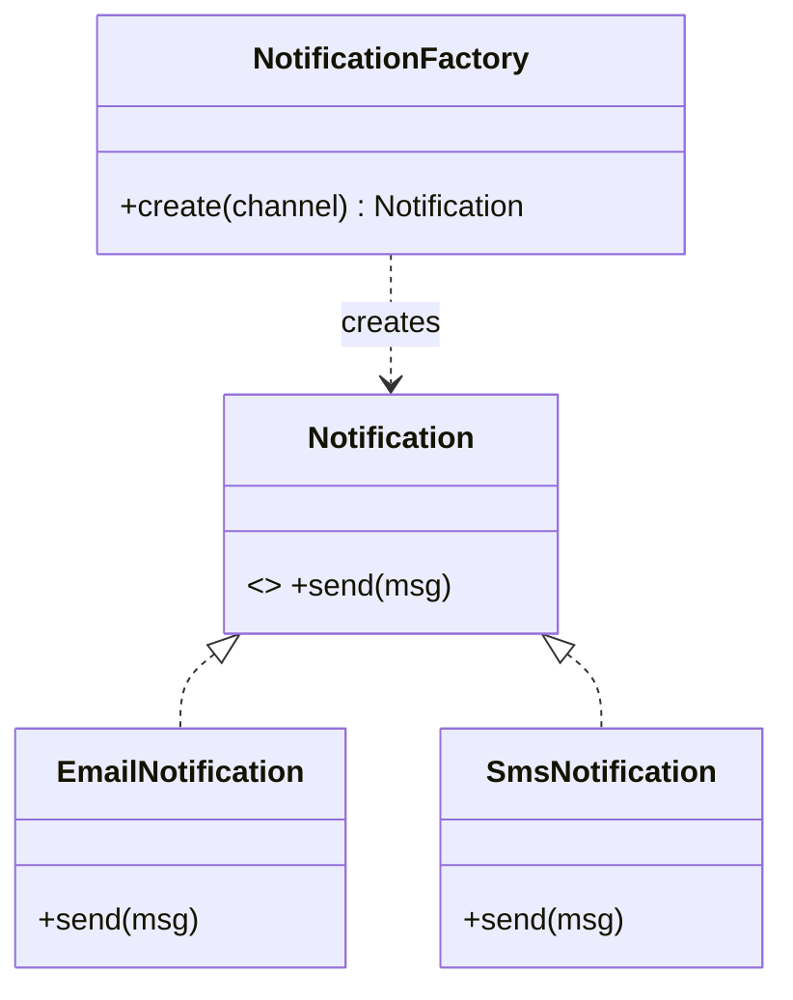

</details>

<details>
<summary><b>🏢 4. Abstract Factory</b> — create families of related objects</summary>

<br/>

**Definition.** Provides an interface for creating **families of related objects** without specifying their concrete classes. One factory produces a whole matching set (e.g. all "Windows" widgets, or all "Mac" widgets).

> 🎯 **Problem it solves**
> When products come in compatible families (a Windows button must pair with a Windows checkbox), creating them individually risks mixing incompatible variants and scatters platform logic everywhere.

> 🛠️ **How it solves it**
> Define an abstract factory with one method per product. Each concrete factory builds one consistent family. Client code picks a factory once, then gets guaranteed-compatible parts — switching the whole theme means swapping one factory.

**💻 Code**

```java
interface Button   { void render(); }
interface Checkbox { void render(); }

class WinButton   implements Button   { public void render(){ System.out.println("🪟 button"); } }
class WinCheckbox implements Checkbox { public void render(){ System.out.println("🪟 checkbox"); } }
class MacButton   implements Button   { public void render(){ System.out.println("🍎 button"); } }
class MacCheckbox implements Checkbox { public void render(){ System.out.println("🍎 checkbox"); } }

interface GUIFactory {
    Button createButton();
    Checkbox createCheckbox();
}
class WindowsFactory implements GUIFactory {
    public Button createButton()     { return new WinButton(); }
    public Checkbox createCheckbox() { return new WinCheckbox(); }
}
class MacFactory implements GUIFactory {
    public Button createButton()     { return new MacButton(); }
    public Checkbox createCheckbox() { return new MacCheckbox(); }
}

// Usage — one factory = one consistent family
GUIFactory factory = new MacFactory();
factory.createButton().render();
factory.createCheckbox().render();
```

**📊 Diagram**

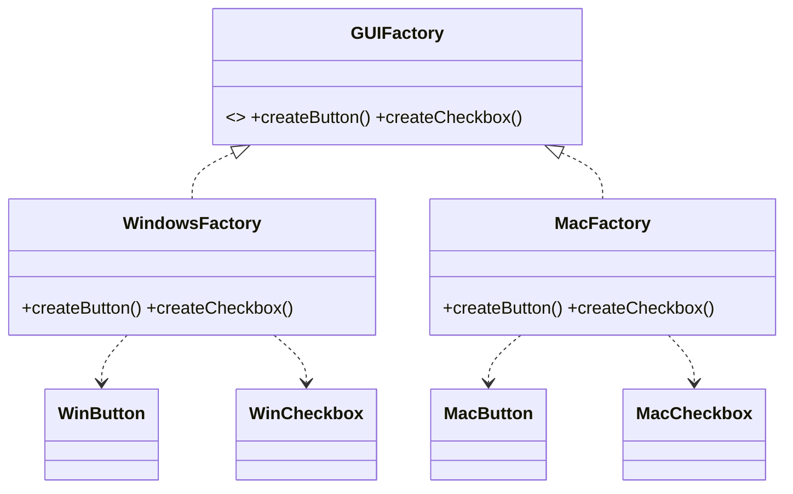

> 🔑 **Factory vs Abstract Factory:** Factory creates **one** product; Abstract Factory creates a **family** of related products.

</details>

<details>
<summary><b>🧬 5. Prototype</b> — clone existing objects instead of building new ones</summary>

<br/>

**Definition.** Creates new objects by **copying an existing instance** (the prototype) rather than constructing from scratch. The object knows how to clone itself.

> 🎯 **Problem it solves**
> Some objects are expensive to create (heavy initialization, DB calls, complex configuration). Building each one fresh is wasteful, and the client may not even know the concrete class needed to reconstruct it.

> 🛠️ **How it solves it**
> The object exposes a `clone()` method that returns a copy of itself. Clients duplicate a ready-made prototype and tweak only what differs — skipping costly setup and staying decoupled from concrete types.

**💻 Code**

```java
public class Document implements Cloneable {
    private String title;
    private List<String> sections;

    public Document(String title, List<String> sections) {
        this.title = title; this.sections = sections;
    }

    @Override
    public Document clone() {
        // deep copy so clones don't share mutable state
        return new Document(this.title, new ArrayList<>(this.sections));
    }
    public void setTitle(String t) { this.title = t; }
}

// Usage — copy a template, then customize
Document template = new Document("Report", List.of("Intro", "Body"));
Document copy = template.clone();
copy.setTitle("Q3 Report");
```

**📊 Diagram**

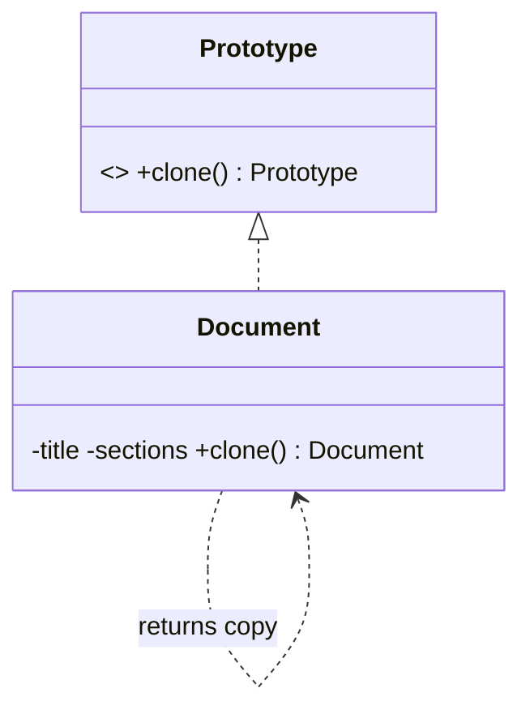

</details>

</details>

---

<details>
<summary><h2>🧱 &nbsp;STRUCTURAL PATTERNS</h2></summary>

> _Patterns that deal with **object composition** — how classes and objects combine into larger structures while keeping them flexible._

<br/>

<details>
<summary><b>🔌 1. Adapter</b> — make incompatible interfaces work together</summary>

<br/>

**Definition.** Converts the interface of a class into another interface the client expects. It acts as a **translator** between two otherwise incompatible types.

> 🎯 **Problem it solves**
> You have an existing/third-party class whose interface doesn't match what your code needs (e.g. a legacy player exposes `playAudio()` but your app calls `play()`). You can't (or shouldn't) modify that class.

> 🛠️ **How it solves it**
> Wrap the incompatible class in an adapter that implements the expected interface and internally delegates to the wrapped object — translating each call. Your client talks to the clean interface, unaware of the legacy details.

**💻 Code**

```java
// Target interface the client expects
interface MediaPlayer { void play(String file); }

// Legacy class with an incompatible API
class LegacyAudioPlayer {
    void playAudio(String fileName) { System.out.println("🎵 " + fileName); }
}

// Adapter bridges the two
class AudioAdapter implements MediaPlayer {
    private final LegacyAudioPlayer legacy = new LegacyAudioPlayer();
    public void play(String file) { legacy.playAudio(file); }  // translate
}

// Usage — client only knows MediaPlayer
MediaPlayer player = new AudioAdapter();
player.play("song.mp3");
```

**📊 Diagram**

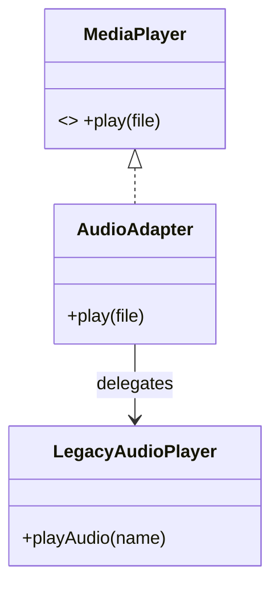

</details>

<details>
<summary><b>🌳 2. Composite</b> — treat individual objects and groups uniformly</summary>

<br/>

**Definition.** Composes objects into **tree structures** and lets clients treat individual objects (leaves) and compositions of objects (branches) through the **same interface**.

> 🎯 **Problem it solves**
> When you have part-whole hierarchies (files & folders, UI elements, org charts), client code ends up littered with "is this a single item or a group?" checks, which are fragile and repetitive.

> 🛠️ **How it solves it**
> Both leaves and containers implement one common interface. A container holds children of that same type and delegates operations down the tree. Clients call one method and the structure handles recursion — no type checks needed.

**💻 Code**

```java
interface FileComponent { int size(); }

// Leaf
class FileLeaf implements FileComponent {
    private final int bytes;
    FileLeaf(int bytes) { this.bytes = bytes; }
    public int size() { return bytes; }
}

// Composite
class Folder implements FileComponent {
    private final List<FileComponent> children = new ArrayList<>();
    public void add(FileComponent c) { children.add(c); }
    public int size() {                       // recurses into the tree
        return children.stream().mapToInt(FileComponent::size).sum();
    }
}

// Usage — folder & file handled identically
Folder root = new Folder();
root.add(new FileLeaf(100));
Folder sub = new Folder();
sub.add(new FileLeaf(50));
root.add(sub);
System.out.println(root.size());  // 150
```

**📊 Diagram**

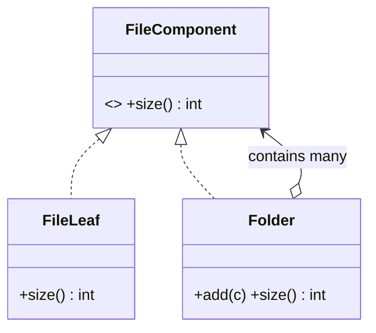

</details>

<details>
<summary><b>🎁 3. Decorator</b> — add behavior dynamically by wrapping</summary>

<br/>

**Definition.** Attaches **additional responsibilities** to an object dynamically by wrapping it in decorator objects that share the same interface. A flexible alternative to subclassing for extending behavior.

> 🎯 **Problem it solves**
> Adding every combination of optional features via subclasses explodes into a class jungle (`CoffeeWithMilkAndSugarAndCream`...). It's rigid and impossible to combine features at runtime.

> 🛠️ **How it solves it**
> Each decorator implements the component interface and holds a reference to a wrapped component, adding its bit of behavior before/after delegating. You stack wrappers freely at runtime to compose any combination.

**💻 Code**

```java
interface Coffee { double cost(); String desc(); }

class SimpleCoffee implements Coffee {
    public double cost() { return 2.0; }
    public String desc() { return "coffee"; }
}

abstract class CoffeeDecorator implements Coffee {
    protected final Coffee inner;
    CoffeeDecorator(Coffee inner) { this.inner = inner; }
}

class Milk extends CoffeeDecorator {
    Milk(Coffee c) { super(c); }
    public double cost() { return inner.cost() + 0.5; }
    public String desc() { return inner.desc() + " + milk"; }
}
class Sugar extends CoffeeDecorator {
    Sugar(Coffee c) { super(c); }
    public double cost() { return inner.cost() + 0.2; }
    public String desc() { return inner.desc() + " + sugar"; }
}

// Usage — stack wrappers at runtime
Coffee order = new Sugar(new Milk(new SimpleCoffee()));
System.out.println(order.desc() + " = $" + order.cost()); // coffee + milk + sugar = $2.7
```

**📊 Diagram**

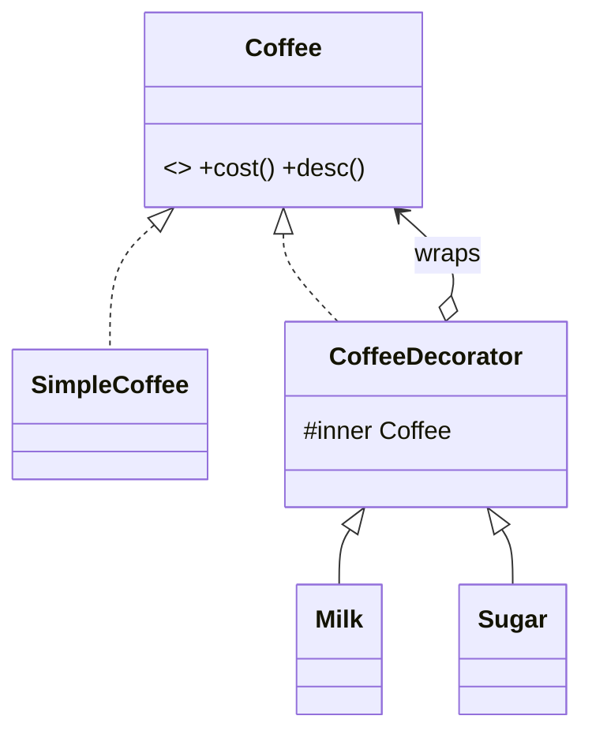

</details>

<details>
<summary><b>🛡️ 4. Proxy</b> — a stand-in that controls access to an object</summary>

<br/>

**Definition.** Provides a **surrogate or placeholder** for another object to control access to it. The proxy shares the real object's interface and adds a layer of control (lazy loading, caching, security, logging).

> 🎯 **Problem it solves**
> Sometimes you need extra control before reaching the real object — defer an expensive creation, check permissions, cache results — but you don't want to pollute the real object or the client with that logic.

> 🛠️ **How it solves it**
> The proxy implements the same interface as the real subject and holds a reference to it. It intercepts calls, performs its control logic, then delegates to the real object (often creating it only when first needed).

**💻 Code**

```java
interface Image { void display(); }

class RealImage implements Image {
    private final String file;
    RealImage(String file) { this.file = file; load(); }
    private void load() { System.out.println("⏳ loading " + file); }  // expensive
    public void display() { System.out.println("🖼️ " + file); }
}

class ProxyImage implements Image {
    private final String file;
    private RealImage real;                 // created lazily
    ProxyImage(String file) { this.file = file; }
    public void display() {
        if (real == null) real = new RealImage(file);  // load on first use
        real.display();
    }
}

// Usage — no load happens until display() is first called
Image img = new ProxyImage("photo.png");
img.display();  // loads, then displays
img.display();  // reuses, just displays
```

**📊 Diagram**

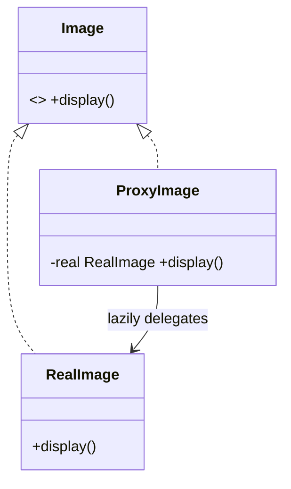

</details>

<details>
<summary><b>🪶 5. Flyweight</b> — share common state to save memory</summary>

<br/>

**Definition.** Minimizes memory use by **sharing** as much data as possible between many similar objects. It separates **intrinsic** state (shared, constant) from **extrinsic** state (unique, passed in).

> 🎯 **Problem it solves**
> Rendering millions of similar objects (trees in a forest, characters in a document) duplicates the same heavy data (texture, font) over and over, exhausting memory.

> 🛠️ **How it solves it**
> Extract the shared, unchanging part into a flyweight object cached in a factory and reused across instances. The unique part (position, etc.) is stored externally and supplied at call time. One texture serves thousands of trees.

**💻 Code**

```java
// Intrinsic (shared) state
class TreeType {
    private final String name, texture;
    TreeType(String name, String texture) { this.name = name; this.texture = texture; }
    void draw(int x, int y) { System.out.println("🌳 " + name + " @(" + x + "," + y + ")"); }
}

// Factory caches & reuses flyweights
class TreeFactory {
    private static final Map<String, TreeType> cache = new HashMap<>();
    static TreeType get(String name, String texture) {
        return cache.computeIfAbsent(name + texture, k -> new TreeType(name, texture));
    }
}

// Extrinsic state lives outside the shared object
Map<String,Integer> coords = Map.of("x",10,"y",20);
TreeType oak = TreeFactory.get("Oak", "oak.png");   // shared
oak.draw(10, 20);
oak.draw(50, 80);                                    // same object, different position
```

**📊 Diagram**

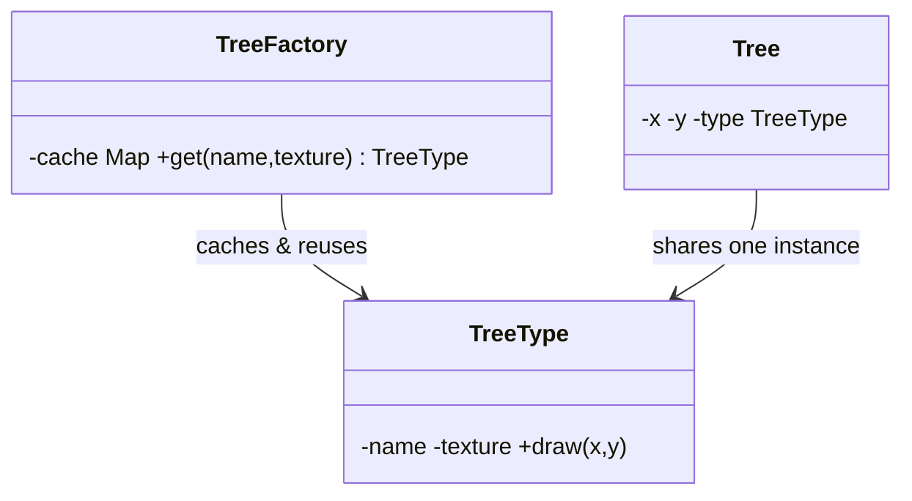

</details>

</details>

---

<details>
<summary><h2>🎭 &nbsp;BEHAVIORAL PATTERNS</h2></summary>

> _Patterns that deal with **communication and responsibility** between objects — how they collaborate and distribute work._

<br/>

<details>
<summary><b>⛓️ 1. Chain of Responsibility</b> — pass a request along a chain of handlers</summary>

<br/>

**Definition.** Passes a request along a **chain of handlers**. Each handler decides either to process the request or to forward it to the next handler in the chain, decoupling sender from receiver.

> 🎯 **Problem it solves**
> When multiple objects might handle a request (validation steps, approval levels, middleware), hardcoding the sender to know who handles what creates rigid, tangled `if/else` logic.

> 🛠️ **How it solves it**
> Each handler holds a reference to the next one. It handles what it can and delegates the rest down the chain. You add, remove, or reorder handlers freely without touching the sender.

**💻 Code**

```java
abstract class Approver {
    protected Approver next;
    public Approver setNext(Approver next) { this.next = next; return next; }
    public abstract void approve(int amount);
}

class TeamLead extends Approver {
    public void approve(int amount) {
        if (amount <= 1000) System.out.println("✅ TeamLead approved " + amount);
        else if (next != null) next.approve(amount);
    }
}
class Manager extends Approver {
    public void approve(int amount) {
        if (amount <= 10000) System.out.println("✅ Manager approved " + amount);
        else if (next != null) next.approve(amount);
    }
}

// Usage — build the chain
Approver lead = new TeamLead();
lead.setNext(new Manager());
lead.approve(5000);   // handled by Manager
```

**📊 Diagram**

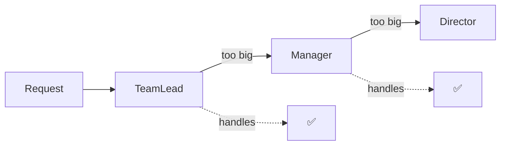

</details>

<details>
<summary><b>🚦 2. State</b> — change behavior when internal state changes</summary>

<br/>

**Definition.** Allows an object to **alter its behavior when its internal state changes** — it appears to change its class. Each state is a separate object encapsulating state-specific behavior.

> 🎯 **Problem it solves**
> Objects with many states (a vending machine, an order lifecycle) accumulate giant `switch`/`if` blocks checking the current state in every method — hard to read and easy to break when adding a state.

> 🛠️ **How it solves it**
> Extract each state into its own class implementing a common interface. The context delegates behavior to its current state object, and states decide the transition to the next state. Adding a state = adding a class.

**💻 Code**

```java
interface State { void next(Order order); String name(); }

class Pending  implements State {
    public void next(Order o) { o.setState(new Shipped()); }
    public String name() { return "PENDING"; }
}
class Shipped  implements State {
    public void next(Order o) { o.setState(new Delivered()); }
    public String name() { return "SHIPPED"; }
}
class Delivered implements State {
    public void next(Order o) { System.out.println("already delivered"); }
    public String name() { return "DELIVERED"; }
}

class Order {
    private State state = new Pending();
    public void setState(State s) { this.state = s; }
    public void advance() { state.next(this); }
    public String status() { return state.name(); }
}

// Usage
Order o = new Order();
o.advance(); System.out.println(o.status());  // SHIPPED
o.advance(); System.out.println(o.status());  // DELIVERED
```

**📊 Diagram**

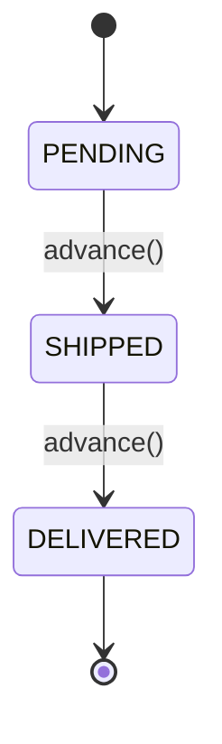

</details>

<details>
<summary><b>👀 3. Observer</b> — notify many objects when one changes</summary>

<br/>

**Definition.** Defines a **one-to-many dependency** so that when one object (the subject) changes state, all its dependents (observers) are notified and updated automatically.

> 🎯 **Problem it solves**
> When several parts of a system must react to changes in another (UI widgets tracking data, subscribers to events), polling or hardwiring them together causes tight coupling and missed updates.

> 🛠️ **How it solves it**
> The subject keeps a list of observers implementing a common interface and pushes notifications to all of them on change. Observers subscribe/unsubscribe freely — the subject never needs to know their concrete types.

**💻 Code**

```java
interface Observer { void update(String news); }

class NewsAgency {                               // Subject
    private final List<Observer> observers = new ArrayList<>();
    public void subscribe(Observer o)   { observers.add(o); }
    public void unsubscribe(Observer o) { observers.remove(o); }
    public void publish(String news)    { observers.forEach(o -> o.update(news)); }
}

class Channel implements Observer {
    private final String name;
    Channel(String name) { this.name = name; }
    public void update(String news) { System.out.println(name + " got: " + news); }
}

// Usage
NewsAgency agency = new NewsAgency();
agency.subscribe(new Channel("BBC"));
agency.subscribe(new Channel("CNN"));
agency.publish("Breaking news!");   // both channels notified
```

**📊 Diagram**

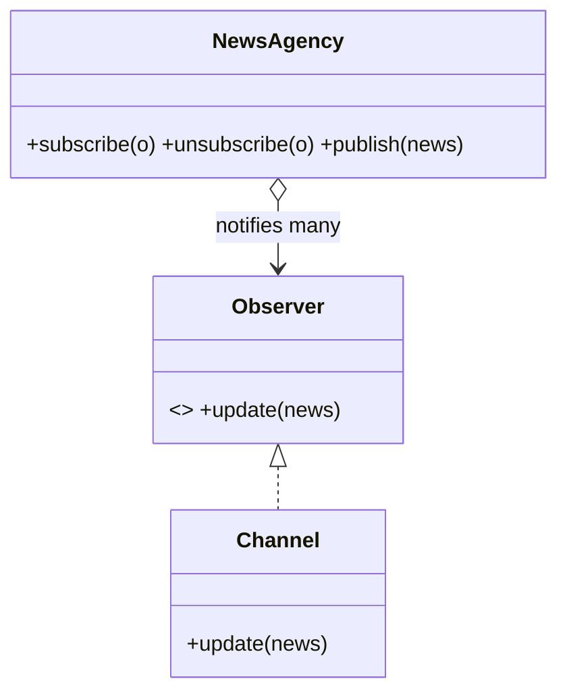

</details>

<details>
<summary><b>📐 4. Template Method</b> — fix the skeleton, vary the steps</summary>

<br/>

**Definition.** Defines the **skeleton of an algorithm** in a base method, deferring some steps to subclasses. Subclasses override specific steps without changing the algorithm's overall structure.

> 🎯 **Problem it solves**
> Several processes share the same overall sequence but differ in a few steps (read → process → save, with different formats). Duplicating the whole sequence in each class repeats code and risks inconsistency.

> 🛠️ **How it solves it**
> A `final` template method in the base class fixes the step order and calls abstract hook methods. Subclasses fill in only the varying steps. The invariant flow lives in one place; only the differences are overridden.

**💻 Code**

```java
abstract class DataProcessor {
    // The template method — fixed skeleton, can't be overridden
    public final void process() {
        read();
        transform();
        save();
    }
    protected abstract void read();
    protected abstract void transform();
    protected void save() { System.out.println("💾 saved"); }  // default hook
}

class CsvProcessor extends DataProcessor {
    protected void read()      { System.out.println("📄 read CSV"); }
    protected void transform() { System.out.println("🔧 parse rows"); }
}

// Usage
new CsvProcessor().process();   // read CSV → parse rows → saved
```

**📊 Diagram**

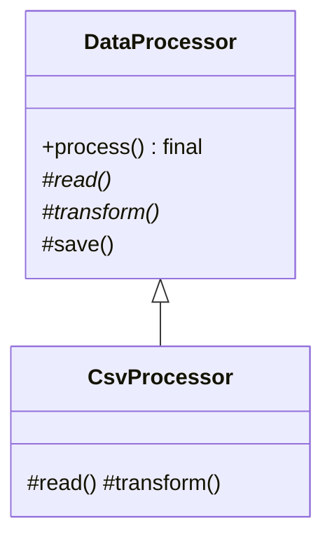

</details>

<details>
<summary><b>🎯 5. Strategy</b> — swap algorithms at runtime</summary>

<br/>

**Definition.** Defines a **family of interchangeable algorithms**, encapsulates each one, and makes them swappable at runtime. The algorithm varies independently from the clients that use it.

> 🎯 **Problem it solves**
> Hardcoding one algorithm (a sorting method, a payment type, a discount rule) with `if/else` branches makes it impossible to switch behavior at runtime and forces edits whenever a new variant appears.

> 🛠️ **How it solves it**
> Each algorithm becomes a class implementing a common strategy interface. The context holds a reference to a strategy and delegates to it, so you inject or swap behavior at runtime without touching the context.

**💻 Code**

```java
interface PaymentStrategy { void pay(double amount); }

class CreditCardStrategy implements PaymentStrategy {
    public void pay(double amt) { System.out.println("💳 paid " + amt); }
}
class PayPalStrategy implements PaymentStrategy {
    public void pay(double amt) { System.out.println("🅿️ paid " + amt); }
}

class Checkout {
    private PaymentStrategy strategy;
    public void setStrategy(PaymentStrategy s) { this.strategy = s; }
    public void pay(double amount) { strategy.pay(amount); }  // delegate
}

// Usage — swap strategy at runtime
Checkout checkout = new Checkout();
checkout.setStrategy(new CreditCardStrategy());
checkout.pay(99.0);
checkout.setStrategy(new PayPalStrategy());
checkout.pay(50.0);
```

**📊 Diagram**

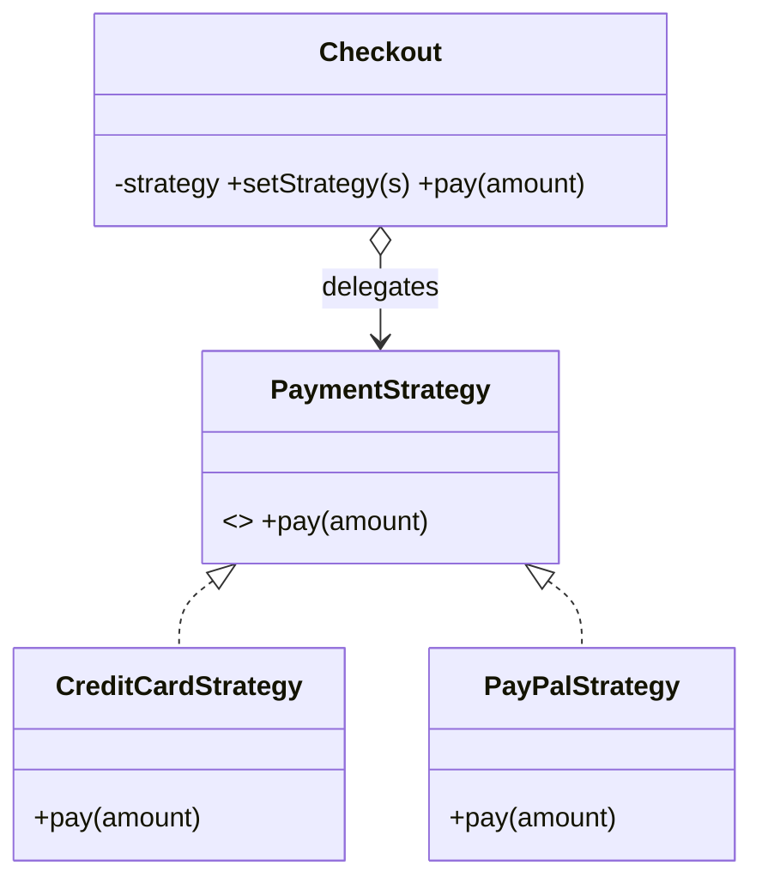

> 🔑 **Strategy vs State:** both swap behavior via objects — but Strategy is chosen by the *client*, while State transitions are driven by the object *itself*.

</details>

</details>

---

<div align="center">

### 🧭 Quick Pick Guide

</div>

```text
   "I need to..."                          → Use this pattern
   ─────────────────────────────────────────────────────────
   ...guarantee one instance               → 🔒 Singleton
   ...build a complex object cleanly        → 🧰 Builder
   ...create one product by type            → 🏭 Factory
   ...create a family of products           → 🏢 Abstract Factory
   ...clone instead of rebuild              → 🧬 Prototype
   ...bridge incompatible interfaces        → 🔌 Adapter
   ...treat tree & leaf the same            → 🌳 Composite
   ...add features by wrapping              → 🎁 Decorator
   ...control access to an object           → 🛡️ Proxy
   ...share data across many objects        → 🪶 Flyweight
   ...pass a request down handlers          → ⛓️ Chain of Responsibility
   ...change behavior with internal state   → 🚦 State
   ...notify many on one change             → 👀 Observer
   ...fix a flow, vary the steps            → 📐 Template Method
   ...swap algorithms at runtime            → 🎯 Strategy
```

---

<div align="center">

⭐ _Design Patterns guide prepared for **Rachit**._ ⭐
_Collapse all sections to use it as a quick-reference index._ 🔽

📌 Open the Markdown preview with **Cmd+Shift+V** to render diagrams & collapsibles.

</div>
